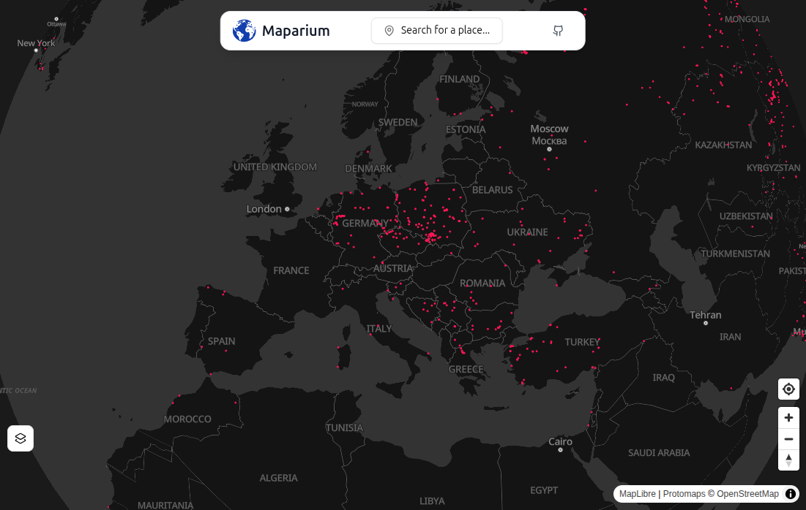

# 🌊 Powodziomierz

**Powodziomierz** is a lightweight and fast web application that provides real-time access to flood prediction data in Poland. It’s a direct response to the official [Hydroportal](https://isok.gov.pl/hydroportal.html), which is often slow and difficult to use.

Built with **React (TypeScript)** and **Vite**, it features a hybrid mapping setup that combines a **MapTiler** basemap with **custom flood prediction data layers** served via a self-hosted **TileServer-GL** instance.

At its current basic stage, the app displays a fullscreen interactive map.

---

## Features

- 🔍 Fast lookup of flood prediction points across Poland
- 🗺️ Interactive map powered by **MapTiler** with custom tile layers
- 🖥️ Vector tiles hosted via self-managed **TileServer-GL**

---

## Upcoming

Here are some features planned for future development:

- [ ] Geolocation-based map centering
- [ ] Search bar for quickly zooming to a specific location
- [ ] Multilingual support (English & Polish)

Have an idea? Feel free to open an issue or contribute!

---

## Tech Stack

- **Frontend**: React + TypeScript + Vite
- **Mapping**: MapTiler base map + custom vector layer
- **Tile Server**: TileServer-GL (self-hosted)

---

## Screenshot



---

## 🔧 Setup & Development

1. **Clone the repository**
   ```bash
   git clone https://github.com/your-username/powodziomierz.git
   cd powodziomierz
   npm install
   ```
