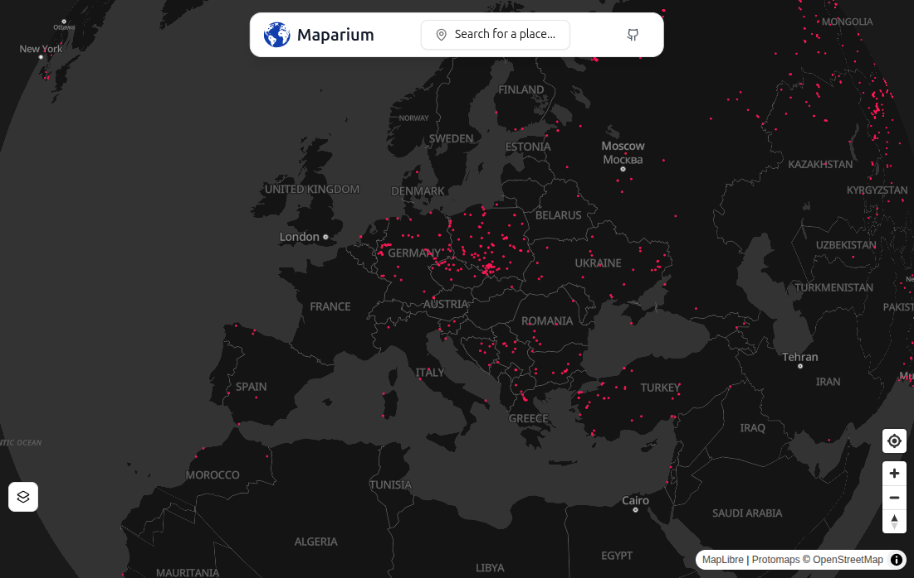

#  Maparium

Maparium is a web application that allows users to display specific OpenStreetMap features globally with very high performance. For example, it can show all wind turbines or all castles from a full-globe perspective in a fraction of a second, while remaining lightweight in terms of hardware requirements. The data is rendered using MapLibre GL JS. The data is hosted on a dedicated server, the configuration of which is not currently included in this repository.

Maparium is built mainly for fun and curiosity, aiming to be a place that brings together a very wide range of topics in one platform while remaining fast and responsive.

## Available Pre Defined Data Layers

| Type           | Layers                                                                                                                                                                                                      |
| -------------- | ----------------------------------------------------------------------------------------------------------------------------------------------------------------------------------------------------------- |
| Power          | Biogas plants, Diesel plants, Solar plants, Biomass plants, Hydro plants, Coal plants, Gas plants, Oil plants, Geothermal plants, Nuclear plants, Waste plants, Battery plants, Tidal plants, Wind Turbines |
| Religious      | Churches, Kingdom Halls, Mosques, Wayside Shrines, Synagogues, Temples                                                                                                                                      |
| Aeroway        | Airports and Runways, Spaceports                                                                                                                                                                            |
| Amenity        | Bars, Cafe, Fast Food, Restaurant                                                                                                                                                                           |
| Education      | University, College, Kindergarten, Library, School                                                                                                                                                          |
| Transportation | Charging Stations, Refueling stations, Train Stations, Highways, Railways                                                                                                                                   |
| Emergency      | Hospitals, Fire Stations, Police Stations                                                                                                                                                                   |
| Geological     | Volcanic Caldera Rims, Paleontological Sites, Glacial Erratics, Rock Glaciers, Meteor Crater, Sinkhole, Volcanos, Cave entrances                                                                            |
| Historic       | Castles, Ruins, Archaeological Sites, Battlefields, Bomb Craters, Forts, Tombs                                                                                                                              |
| Military       | Bases and Airfields, Bunkers, Nuclear Explosion Sites                                                                                                                                                       |
| Telecom        | Data centers, Telecom lines                                                                                                                                                                                 |
| Tourism        | Attractions, Hotels, Hostels and Motels, Artwork, Camp Sites, Galleries, Museums, Theme Parks, Viewpoints, Zoo                                                                                              |

## Tech Stack

- **Frontend**: React, Vite, MapLibre GL JS
- **Mapping**: Protomaps base map and custom mbtiles extracted from OpenStreetMap for all additional layers
- **Data pre-processing**: omsium-tool, tippecanoe, ogr2ogr

## Screenshot



## Setup & Development

1. **Clone the repository**

   ```bash
   git clone https://github.com/your-username/maparium.git
   cd maparium
   npm install
   ```

2. **Backend**

   Data preprocessing and hosting are beyond the scope of this README. Proper instructions will be provided in the future. If you want to contribute to the frontend, Vite is configured so that the development build uses the Maparium server to display tiles.

## Theming

- Maparium uses semantic Tailwind tokens from `src/index.css` (`bg-background`, `text-foreground`, `border-border`, `bg-card`, `text-muted-foreground`) so components work in both light and dark modes.
- The initial app theme is derived from the user's system preference (`prefers-color-scheme`).
- A runtime Light/Dark toggle is available in the top navigation.
- The map basemap flavor follows the current app theme, using Protomaps dark (`black`) for dark mode and Protomaps light (`light`) for light mode.
- For new components, prefer semantic tokens over hardcoded colors to keep theme behavior consistent.

## Upcoming

The next big step would be opening Maparium to user contributions, allowing users to add new layers with features that are not part of the predefined set. This would require user accounts and additional backend processing.
