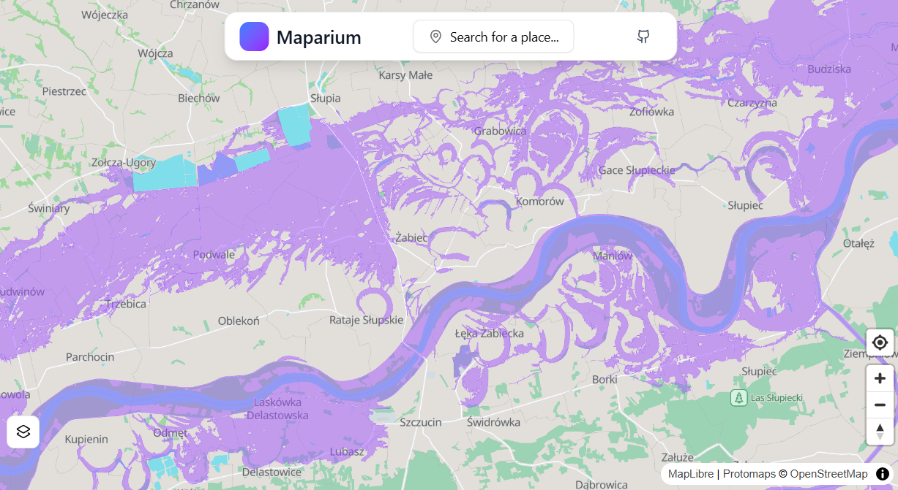

# 🗺️ Maparium

**Maparium** is a lightweight web application that provides access to geospatial data across Poland. Built as a comprehensive GIS platform, it offers multiple data layers, including flood predictions, drought visualization, demographic data, and more—serving as a modern alternative to slow and difficult-to-use official portals.

Designed for everyday citizens, students, journalists, and curious minds, Maparium aims to make GIS data accessible and intuitive. While official government websites are feature-rich for GIS professionals and officials, they are often too slow and complex for spontaneous use. Maparium's mission is to simplify access to this data.

Built with **React (TypeScript)** and **Vite** for the frontend, Protomaps basemap, and custom pmtiles for the backend, the website currently works as a serverless solution.

---

## Upcoming

Here are some features planned for future development:

- [ ] Additional environmental data layers (air quality, temperature, precipitation, demographics, drought areas)
- [ ] Search bar for quickly zooming to specific locations
- [ ] Historical data comparison tools
- [ ] Polish language support

Have an idea for a new data layer or feature? Feel free to open an issue or contribute!

---

## Available Data Layers

### Environmental

- **Flood hazard map**: Areas of flood hazard for rivers and seas with varying probabilities or levee breaches

_More layers are continuously being added._

---

## Tech Stack

- **Frontend**: React + TypeScript + Vite
- **Mapping**: Protomaps base map and custom pmtiles for all additional layers
- **Data pre-processing**: QGIS, tippecanoe, planetiler

---

## Screenshot



---

## Setup & Development

1. **Clone the repository**

   ```bash
   git clone https://github.com/your-username/maparium.git
   cd maparium
   npm install
   ```

2. **Pmtiles**

   Data preprocessing and hosting pmtiles are beyond the scope of this README. Proper instructions will be provided in the future. If you want to contribute to the frontend, Vite is configured so that the development build uses the Maparium server to display tiles.

---

## Data Source

Maparium aggregates data from various Polish governmental sources through [dane.gov.pl](https://dane.gov.pl/pl).
